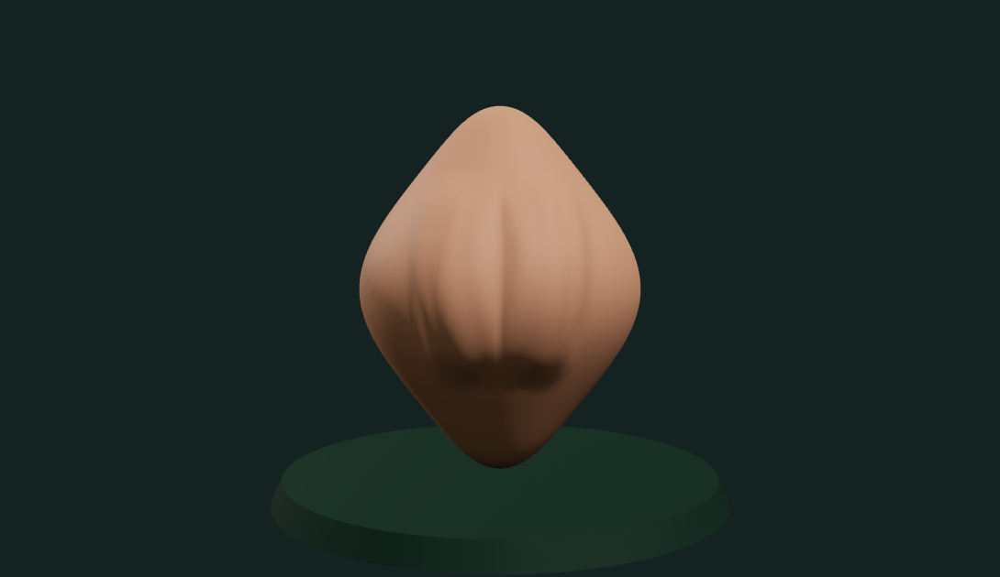
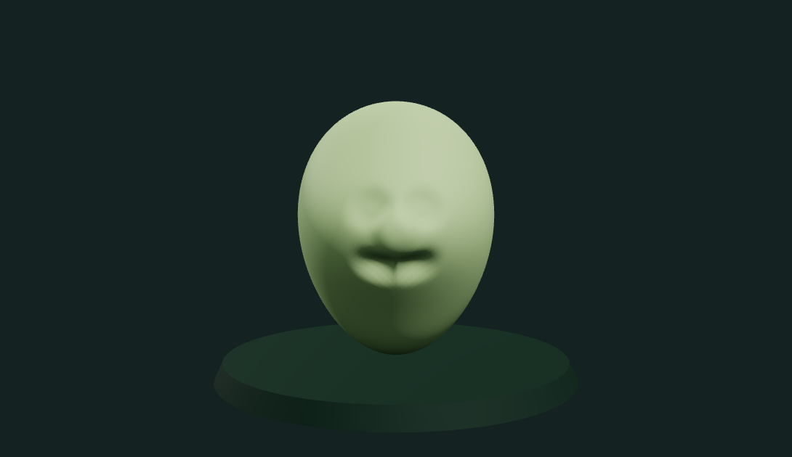

# Digital Clay

A browser sculpture workbench using 10,242 welded vertices and 20,480 triangles. The uniform icosphere avoids UV seams and concentrated pole fans. Inflate moves vertices along their surface normals; Smooth uses local Laplacian averaging; Flatten projects toward the smoothly interpolated picked tangent plane; Crease combines inward displacement with tangential pinching. Each dab is limited relative to its neighboring edge lengths. Surface orientation prevents a brush from affecting an oppositely facing nearby surface. Mirrored strokes choose the nearest of the two centers rather than applying twice across the symmetry plane.

Drag directly on the form in Sculpt mode. Pointer paths are resampled at fixed spatial intervals, so sparse and frequent pointer events describe the same stroke; holding still adds no more dabs. Smoothly interpolated hit normals avoid triangle-by-triangle cursor jumps. Right-drag or Alt-drag temporarily orbits, scrolling zooms, and Orbit mode is also available. Camera damping is disabled for this tool so it cannot coast under a new brush stroke.

Each completed stroke saves one undo checkpoint, up to 30. Escape, pointer cancellation, a lost window focus, or switching to another tool rolls back the unfinished stroke. The active brush settings are captured when a stroke starts. Stamp front remains a keyboard alternative; direct dragging is the primary workflow. The preset selector rebuilds the actual base geometry. OBJ and PNG exports are available.

## Limits

Fixed topology; no dynamic remeshing, boolean subtraction, pressure-sensitive stylus support, UV painting, or self-intersection prevention. Strong edits can stretch triangles. Brush radius is Euclidean, not geodesic: similarly oriented nearby folds can still be affected together. Displacement limits reduce abrupt folding but do not prove freedom from self-intersections after repeated heavy edits. Undo is local to this session. The vessel preset is a closed sculpting blank, not a hollow container.

## Development

`npm test`, `npm run test:browser`, `npm run dev`, and `npm run build`. Install Chromium for browser tests with `npx playwright install chromium`. Three.js 0.180 is the geometry and rendering dependency. The shared Graphics Workbench supplies the camera, lighting, accessible controls, lifecycle management, and exports. Both the standalone tool and portfolio import `createExperiment` from the same module.

## Run and explore

[Open the portfolio demo](https://zachsm.com/experiments/digital-clay). This repository runs independently and exports the same implementation used by the portfolio.

Requires Node.js 22 or later.

```sh
npm ci
npm test
npm run dev
```

`npm run build` produces a static site in `dist`. Editing, uploaded files, and exports stay in the browser. No account, server processing, or GitHub Actions is required.

## Captured examples



Raised ribs on a closed vessel blank, made with direct mirrored drag strokes.



A mask shaped with crease, inflate, and smooth drag strokes.

Exact reproduction steps are recorded in [the example manifest](examples/manifest.json).
